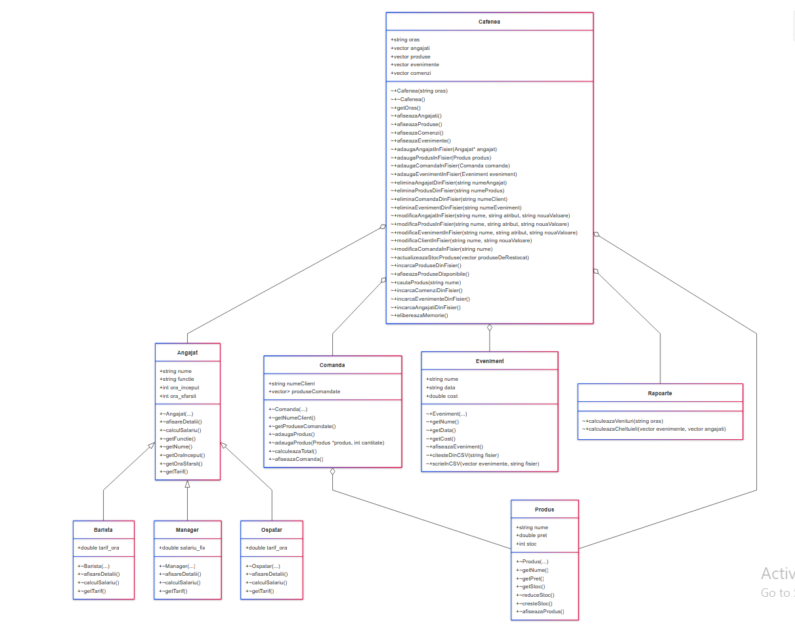

# OOP Project: The Journey of Coffee in Romania

This is the project for the Object-Oriented Programming (OOP) laboratory, created by **CristianIonut7**.

## Project Description

The project consists of a console application (written in C++) for managing a fictional network of coffee shops in Romania. The application allows for the centralized administration of resources, staff, and sales for 5 distinct cities: **Bucharest, Cluj-Napoca, Craiova, Severin**, and **Brasov**.

The main goal is to simulate a management system that helps with:
* Staff organization (hiring, schedules, payroll)
* Management of product stocks
* Recording orders and calculating costs
* Planning special events
* Generating financial reports

## Main Features

The application is structured around an interactive menu which, after selecting a city, allows the user to perform the following operations:

1.  **Employee Management:**
    * Add new employees (Barista, Manager, Waiter).
    * Remove employees from the system.
    * Modify an employee's data (e.g., hourly rate).
    * Display the complete list of employees for the selected coffee shop.

2.  **Product (Stock) Management:**
    * Manage stocks and prices for various products (coffee, tea, sweets, etc.).
    * Add or remove products from stock.

3.  **Order Management:**
    * Record orders placed by customers.
    * Automatically calculate the total price.
    * A discount system for loyal customers (as per requirements).
    * Update product stock when an order is placed (or deleted).

4.  **Event Management:**
    * Organize and plan special events (e.g., coffee tastings, live music).
    * Calculate the costs associated with these events.

5.  **Financial Reports:**
    * Generate a daily financial report.
    * View the report detailing revenue, expenses (product costs, salaries), and total profit.

All data is persisted and read from **CSV files**, with support for import and export (as per requirements).

## OOP Concepts Covered

The project was developed based on the fundamental principles of Object-Oriented Programming:

* **Classes and Objects:** Structuring the application into logical classes (`Cafenea`, `Angajat`, `Produs`, `Comanda`, `Eveniment`, `Rapoarte`).
* **Encapsulation:** Protecting member data (`private` attributes) and exposing them in a controlled manner through public methods (`public`).
* **Inheritance:** Creating a class hierarchy, with a base class `Angajat` and derived classes `Barista`, `Manager`, `Ospatar`.
* **Polymorphism:** Using virtual functions (e.g., for differentiated salary calculation).
* **Abstraction:** Defining common interfaces through base classes (possibly abstract).
* **Constructors and Destructors:** For proper initialization and cleanup of memory and resources.
* **Templates:** (as per requirements)
* **Exceptions:** For robust error handling (e.g., reading files, invalid data).
* **Design Patterns:** The project implements the **Singleton** pattern for the `Cafenea` class, ensuring a single global instance that manages the application data for the selected city.

## Application Architecture

The project's class diagram illustrates the relationships between the main entities:

* **`Cafenea`:** The main class (possibly Singleton) that orchestrates the entire application. It contains vectors of employees, products, orders, and events, and manages interactions with CSV files.
* **`Angajat`:** A base class that defines common attributes (name, schedule, rate).
    * **`Barista`, `Manager`, `Ospatar`:** Derived classes that inherit from `Angajat` and can have specific attributes (e.g., `salariu_fix` for Manager).
* **`Produs`:** Stores information about menu items (name, price, stock).
* **`Comanda`:** Represents a customer's order, containing a list of products.
* **`Eveniment`:** Represents a special event organized by the coffee shop.
* **`Rapoarte`:** A utility class responsible for aggregating data and calculating financial indicators.



## How to Run

1.  Clone the repository:
    ```bash
    git clone https://github.com/CristianIonut7/CafenelePOO
    ```

2.  Navigate into the project directory:
    ```bash
    cd CafenelePOO/src
    ```
    
3.  **Note for Linux/macOS Users:** This `Makefile` is configured for Windows and uses the `del` command. Before compiling, please edit the `Makefile`:
    * Find any lines containing `del /F ...` (likely in the main target and in `clean`).
    * Replace them with `rm -f ...`

4.  Compile the project using `make`. This command will read the `Makefile` and compile all the necessary source files.
    ```bash
    make all
    ```

5.  Run the generated executable (its name is defined in your `Makefile`, it's typically the project name or `main` / `app`):
    ```bash
    ./cafenea.exe
    ```

6.  (Optional) To clean up the compiled files (the `.o` files and the executable), you can use the command:
    ```bash
    make clean
    ```
    
## Project Deliverables

This repository contains all the required deliverables for the project:
* The complete source code (`.cpp` and `.h`).
* Data `.csv` files (for employees, products, orders, etc.).
* A 90-second **Demo Video** (`Demo.webm`) presenting a complete flow of the application.
* A **Test Matrix** with over 20 functional tests.
* The class **Architecture Diagram** (included above).
